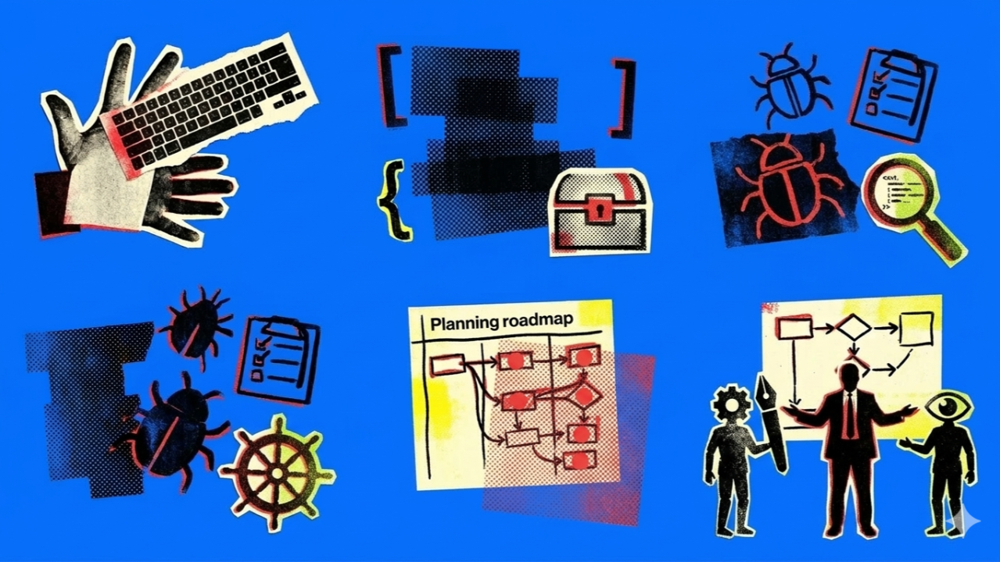

Much of the excitement around AI in software development has centered on a single question: *will AI replace developers?* But that question is too blunt. It skips over the interesting part: the gradual, uneven shifts in what teams and people will encounter.

Like much of AI, the vision of “fully autonomous software teams” suffers from being too overhyped. People paint a picture of agents that write, test, deploy, and monitor entire systems while humans nap. While it's a compelling picture, its unlikely that’s how things will actually change.

It's more useful to build toward that vision in small, concrete steps: with each one defined not by what *AI can do*, but by what *humans can***stop doing***:*

- **Level 1:**Eliminating grunt work - You *stop* typing the obvious.
- **Level 2:**Persistent context - You *stop* re-teaching the AI on what it should already know.
- **Level 3:**Descriptive prototyping - You *stop* documenting requirements, and start describing scenarios.
- **Level 4:**Delegated building - You *stop* writing features, and start steering AI agents that do.
- **Level 5:**Proactive surfacing - You *stop* initiating. The system suggests what to focus on, before you think to ask.

## Level 1: Eliminating grunt work

*You stop typing the obvious.*

The system handles boilerplate. Autocomplete that actually understands your codebase. SQL queries described in plain English. Test scaffolding generated from acceptance criteria. Bug reports formatted from a screenshot and a few clarifying questions.

The system isn't making decisions. It's just doing the mechanical work you'd have done anyway (e.g. filling forms, writing the query, scaffolding the test) so you can get to the thinking faster.

"Show me all orders from the last 24 hours where payment succeeded but shipment wasn't created."

Most teams are already working towards here. The gains are real but modest. You're still deciding everything. You're just typing less.

## Level 2: Persistent context

*You stop re-teaching the AI on what it should already know.*

"What's the impact of adding a bulk-upload feature to the grants module?"

The system already knows your architecture, your naming conventions, your test coverage patterns. It knows which modules are well-documented, and doesn't need you to describe the codebase before every task.

You're still deciding what to build. But the analysis that used to require a senior developer's time (e.g. tracing dependencies, identifying conflicts, estimating ripple effects) now takes minutes instead of days.

The hard part here isn't the technology. It's making the context accurate enough to trust. An agent that *confidently & incorrectly* tells you a change is isolated, especially when it touches a poorly-documented legacy module, can be worse than having no agent at all.

## Level 3: Descriptive prototyping

*You stop documenting requirements, and start describing scenarios.*

"I need an interactive prototype for a school enrollment flow. Parents should be able to select courses, see scheduling conflicts in real time, and submit a waitlist request. The design should feel lightweight with no dense forms."

Instead of writing user stories, then wireframes, then getting feedback, then revising docs — you describe what you need, and an agent builds something clickable in code. Stakeholders react to something tangible. Feedback gets concrete: *"When I click here, I expected this to happen."*

The code prototype becomes **the** specification. The requirements becomes a *derived* artifact, generated from the prototype itself.

The AI derives meaning and truth from the UX patterns and existing function logic within the prototype. Annoyingly abstract requirements meetings become shorter, because there's something real to point at.

## Level 4: Delegated building

You stop writing features, and start steering AI agents that do.

"Build the feature from the approved prototype with AI agents.

A developer picks up an AI-suitable assignment and directs a swarm of coding agents in parallel: describing intent, reviewing generated output, validating that what got built actually solves the problem. The raw implementation is drafted by agents. The judgment stays human. *Is this accurate? Is this the right trade-off? Will this break under load?*

Code review becomes conversation review, because the prompt chain that led to the code carries half the context.

This is what most people mean today when they talk about AI-native teams. But it only works if someone is deliberately shaping how agents and humans hand off to each other. When should agents ask for confirmation? When should they move fast and flag issues later? How verbose should their communication be? These are design decisions about a new kind of teamwork, and they need an orchestration lead who treats them as seriously as architectural decisions.

## Level 5: Proactive surfacing

You stop initiating. The system suggests what to focus on, before you think to ask.

The AI notices that a dependency three modules deep has been updated in a way that conflicts with your current sprint's work. It surfaces a [zero-day vulnerability](https://www.axios.com/2026/02/05/anthropic-claude-opus-46-software-hunting) before standup. It drafts a recommended approach and identifies who on the team has the most context to review it.

A client submits a change request. Before anyone triages it, the system has already mapped the impact (e.g. which modules, which requirements, which tests) and suggested whether this is a localized fix, a multi-sprint effort, or an architectural conversation.

This is the most futuristic level, where the system acts on patterns it's learned from your team's history. The right things surface before you think to ask. (This is what new tools like OpenClaw, Perplexity Computer and Claude Cowork is aiming for.)

## What sticks, and what doesn't

Here's where I want to raise the important (yet often forgotten) concept: [change readiness](https://www.pmi.org/learning/library/change-readiness-11126).

Each of these levels is *plausible* in the near term. The harder question is which ones actually survive contact with a real team: with real habits, real politics, real resistance to change.

I've watched innovation efforts that sparkled in a pilot and died the moment the champion moved on. The prototype impressed stakeholders, but nobody maintained the workflow. The AI-assisted process saved time in theory, but the team quietly reverted to what they knew because the new way felt brittle, or unfamiliar, or like it belonged to someone else.

The levels that stick won't be the cleverest ones. They'll be the ones shaped *with* the team, tested in their actual conditions, and held loosely enough that people can make the practice their own.

Level 1 sticks easily because it asks very little of anyone. Level 4 demands a cultural shift that most teams just aren't ready for, even if the tools are good enough.

Before asking *"which level should we aim for?"*, the better question might be: **is the team ready to let things be different?**

## What changes shape

If this progression holds even roughly, a few things follow:

- **The skill that matters most becomes judgment.** When anyone can generate code, the differentiator is knowing what to build, when to trust the output, and when to override it. The sharpest thinkers win, not the fastest typists.
- **Verification becomes a discipline, not a step.** AI-generated work reads correctly even when it isn't. Teams will need explicit practices (e.g. sampling, checklists, adversarial review) to catch what looks polished but is quietly wrong.
- **Learning paths break.** Juniors traditionally build intuition by struggling through implementation. If agents handle the struggle, how do people develop the judgment to direct them? New apprenticeship models will be needed; ones where the skill being practiced is *reviewing and steering*, not just writing.
- **New roles emerge in the space between.** The orchestration lead isn't a traditional tech lead. The prototyper isn't a traditional BA. As the time from idea-to-implementation gets compressed, new roles will emerge for this new environment where code gets cheaper but coordination gets harder.

## An invitation

This is one way to imagine the progression. The levels might be wrong. The sequence might collapse. Maybe teams leap from Level 1 to Level 4 and skip the middle entirely. Maybe some levels prove to be dead ends that need to be retired when the ground shifts beneath them.

But I think there's value in imagining concretely and incrementally, rather than in a single utopian leap. *"AI will change everything"* is too vague. *"Here's exactly what happens in 2027"* is too certain. Something in between: a progression you can point at, react to, and argue with.

What did I get wrong? What's missing? Where does your team actually sit today, and what would it take for the next level to stick?
