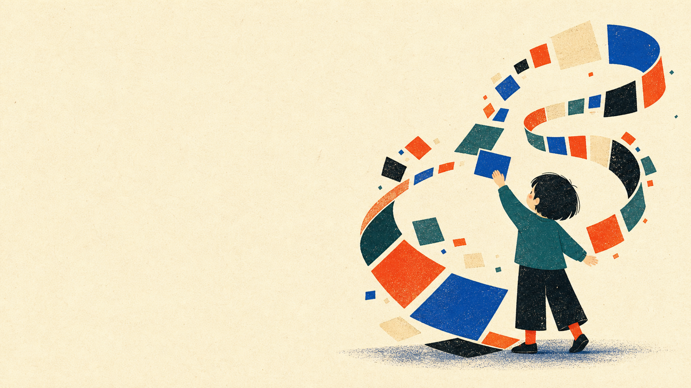

In Singapore, whenever there's something new to learn, it seems like many of us default to a familiar pattern of behaviour: finding a training course to attend.

It's a national habit, and the whole apparatus is there to make it easy: SkillsFuture credits to spend, Coursera and Udemy a click away, Training Providers with a catalogue and a certificate waiting at the end. 

So when AI became the thing everyone was suddenly supposed to learn, the machinery did what it does. Prompt engineering and ChatGPT courses appeared, with organisations promoting training and people signing up.

For me, a lot of this felt oddly hollow. I think I finally understand why, and it comes down to two very different ways of learning something.

## What courses are good at

A course works by packaging someone else's understanding into a form they can hand to you. That's useful because it saves you from slowly, painfully rediscovering what someone already knows.

But it only works on one condition: the subject being taught has to be timeless enough.

Newton's Laws of Motion can be taught well because many share the same understanding on this topic, and the answers it provide will remain true across time. The syllabus written this year is still right next year, and the examiner knows what a "correct answer" looks like. 

In other words, courses are great for stable, slow-moving, well-understood things, which, until pretty recently, covered most of what a person needed to learn.

## But topics like AI are evolving quickly

For something like AI, this field isn't a settled subject, and the advice keeps shifting. Not long ago, the standard tip to squeeze better answers out of an AI model was to add "Let's think step by step" to your prompt, or by opening with a persona like "You are a world-class expert in...". Both were taught as essential prompting know-how, yet newer AI models these days can now reason on their own and no longer need such "techniques".

Things move even faster in the space of AI tools. There's a constant churn of new ways to work: [ChatGPT](https://chatgpt.com/), then [OpenClaw](https://openclaw.ai/), then [Claude Cowork](https://www.anthropic.com/product/claude-cowork), each one quietly redefining what "knowing how to use AI" even means. A course built on tools made 3 months ago might already be half out of date before its first class even begins.

This isn't the fault of the course, or of whoever wrote it. The course may still be useful as a starting point. The problem is mistaking the starting point for the whole journey. There's no settled answer to package up, because the timeless understanding doesn't exist yet in a form anyone could hand you.

So after instruction has taken you as far as it can, another teacher has to take over: *reality itself*.

## The other way to learn

Learning from reality has a name: **play**.

I know "play" sounds like a soft word for something this important. But take a few steps back, and play is just this: you try something before you fully understand it, you watch what happens, and you adjust.

Hand a child a tablet. No one sits them down and walks them through the grid of apps, or demonstrates how swiping differs from tapping, or explains what the home button does. They just poke at icons, watch what opens, drag things sideways, accidentally open the camera, close it, find it again. Within an hour they're navigating the device better than some adults.

And here's what makes this more than cute: the surface underneath them never stays still. Apps update, layouts change, new ones appear, old ones vanish. The thing they mastered last week might look different today. There is no settled version of the user interface to be taught, and yet the child doesn't care. They just play again. They've learned something deeper than any single interface: how to feel their way through an unfamiliar one.

Play looks inefficient because it's full of mistakes. But when a subject is still shifting and changing, the mistakes aren't waste. They're the only signal you've got, because reality is the only thing that actually knows the answer.

This was roughly the thread [Olof Schybergson](https://www.linkedin.com/in/olofschybergson/) pulled on at [a recent dialogue session on human-centred AI by Lorong AI](https://luma.com/7ni74a2k). With his experience at Fjord and Accenture Song, he could easily have talked about process or rigour. Instead, he talked about play, and his theory that the future of work will be playful.

## But play is for children

There's an obvious objection here, and it's the gut feeling that play is something we file under "childish behaviour". Adults are supposed to have grown out of it.

Look at how we act at work. We show up as "professionals". We execute tasks, follow processes, move tickets across a board, report against KPIs. All of that is lesson mode in office clothes: a known outcome, a defined path, a clear definition of done. There's no place on a performance review for "spent three weeks playing with a new tool, shipped nothing, but now actually understands it". And when play does sneak into adult work, we quietly rename it into something that sounds more responsible. We call it research, or exploration, or a pilot.

To be fair, some workplaces already invest in this. Hackathons and innovation sprints are proof that play works, and the people who join them come away sharper and more willing to experiment. But the people who show up tend to be the ones already comfortable with uncertainty. The people who most need to play are often the ones the format never reaches.

So the exact mode a shifting subject demands is the one professional life has trained us to suppress. We didn't lose the ability to play. We were taught, gently and constantly, that it isn't what serious people do.

## Play runs on agency

Play has a requirement of its own, and that's where [Philip Man](https://www.linkedin.com/in/philkcman/?utm_source=luma) comes in. Also speaking at the same talk, Philip heads GovTech's newly formed Innovation Office, focused on prototyping the next generation of public services. He kept coming back to two ideas: intention and agency.

Agency, the way he frames it, is the space between intent and action. It's not just permission to act. It's the room to act early, on an unfinished idea, and to be corrected by whatever happens next. Take that room away and you don't have play anymore. You've got a lesson with extra steps, where someone has already decided what the right outcome is and you're just walking toward it.

So learning something genuinely new isn't really about finding the right course. It's about whether you have the agency to play your way into it.

I see this in my own work. I didn't learn to build software with AI from a course. I learned it by building small tools for myself, shipping things that were a bit broken, and letting each one show me what I'd misunderstood. No syllabus could have given me that, because the subject kept moving while I was learning it. What made it work wasn't instruction, but the permission I gave myself for the early attempts to be bad.

## The same word, aimed at machines

Here's a strange echo. Agency is also the word the AI industry has landed on for its most capable systems. An [agentic AI system](https://www.ibm.com/think/topics/agentic-ai) is software given room to act toward a goal, to take steps and make choices instead of waiting for instruction at every turn.

And a lot of the careful work happening right now is to "contain" that agency. [Spec-driven development](https://martinfowler.com/articles/exploring-gen-ai/sdd-3-tools.html), for example, asks you to define the inputs, outputs, constraints, and edge cases up front, so the model builds against something close to a finished blueprint. One effect of that is to shrink the model's room to wander. Less agency, fewer surprises.

We do this for good reasons. The more room a system has to act, the more room it has to be wrong and "hallucinate", and someone has to answer for what it did. Containing agency buys us safety and accountability. For an AI system running in production, that trade-off is often a sensible one.

I just want to point out that we use the same word for our people. And we tend to treat it the same way.

## Developing people, or containing them?

Look again at what "development" usually means for adults at work: a defined curriculum, an approved course, a certificate at the end. From Coursera to corporate learning vendors to national upskilling programmes, the whole training industry shares one assumption: that the thing worth learning can be packaged into a syllabus with a measurable outcome.

Like spec-driven development, this is reassuring precisely because it's legible, plannable, and accountable. You can point at the syllabus and say, *look, this is what we're doing for them*.

Again, that's fine when the learning subject is well understood. But when we ask people to figure out something genuinely shifting, training courses are not enough on their own. Such subjects need lessons and play, but the play is where the real judgment forms. Yet everyone keeps reaching for the contained path and is puzzled when the training doesn't stick.

True learning and development, for a world that keeps moving, would mean widening agency instead of narrowing it. Giving people real problems, real stakes, and real permission to be wrong. Letting reality do some of the teaching. The difficult part is that play resists the logic of the adult world: it is hard to budget for, hard to manage, and hard to justify before anyone knows what it will reveal.

## The space that isn't there yet

With our AI systems, we've decided, sensibly, to contain agency for the sake of safety and accountability. With people, we haven't quite made the same deliberate choice. We've just never built the infrastructure for anything else.

Our entire learning setup (courses, certificates, KPIs, credits) was designed for a world where the thing worth learning could be packaged into a syllabus. The system left little room for play, because the subjects it was built for never demanded it.

A course can only carry you as far as someone has already mapped. Past that line, the work is no longer to deliver the right lesson. It is to design the conditions where playful learning can actually happen.

We already know how to do this for machines. Every digital system gets a sandbox, a staging environment, a place where it can fail without consequence. We would never skip that step for software. But for people learning something new, we skip it all the time. We hand them a course and expect them to come back production-ready. The work ahead is giving people what we already give our software: somewhere safe to fail.
