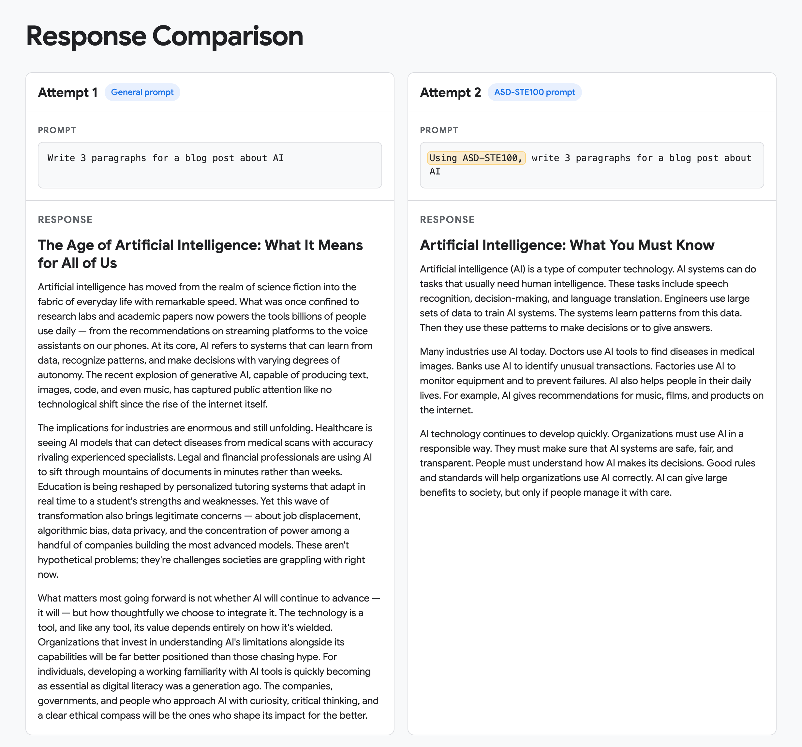
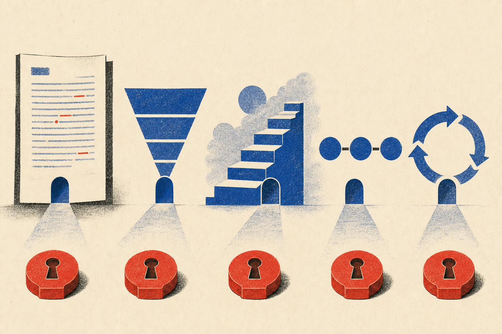

I gave an AI model two almost identical prompts.

The first was straightforward:

> Write 3 paragraphs for a blog post about AI.

The response was exactly what you might expect. It opened with artificial intelligence moving "from the realm of science fiction into the fabric of everyday life". It moved through healthcare, finance, education, job displacement, and data privacy, before closing with a call for companies, governments, and individuals to approach AI with curiosity, critical thinking, and a clear ethical compass.

The response was factually serviceable and stylistically generic. It sounded like something AI would write.

For the second attempt, I added one short phrase:

> Using ASD-STE100, write 3 paragraphs for a blog post about AI.

The difference was immediate.

The grand opening and wide sweep across society disappeared.

Instead, the response used short, direct statements:

> Artificial intelligence is a type of computer technology.

> Many industries use AI today.

> AI technology continues to develop quickly.

Same model. Same task. One additional reference. A completely different voice.

## The instruction hidden inside one term

[ASD-STE100](https://www.asd-ste100.org/) is a controlled form of English developed for aircraft maintenance documentation.

It was designed for a practical problem. Aircraft technicians came from different countries and had different levels of English proficiency. Maintenance instructions needed to be understood consistently, because ambiguity around an aircraft is more than a writing problem.

The standard controls vocabulary and grammar. It asks writers to use short sentences, keep each paragraph to one topic, avoid unnecessary synonyms, and use words only with their approved meanings. The latest standard runs to more than 400 pages.

I explained none of that in the prompt. I only wrote `ASD-STE100`.

To be clear, I cannot prove that this exact aircraft-writing standard appeared in the model's training data. Model providers do not disclose every document their systems learn from, and I have not formally checked the response for full compliance. Yet, in my example above, the model responded as if the term pointed towards a particular body of writing practice.

Whether it encountered the standard directly, or absorbed explanations and examples of it elsewhere, the connection was available enough to change the response.

## This is what a trigger word does

I have started thinking of terms like `ASD-STE100` as **trigger words**.

A trigger word is a compact reference to a much larger set of established practices. I use "word" loosely here; many are phrases, acronyms, or the names of standards.

Consider something much more ordinary: asking AI to edit an email.

Without a clear boundary, the AI might rewrite the whole message. The grammar improves, but your phrasing disappears. A quick correction comes back sounding like a corporate announcement written by someone else.

Ask it to make `Atomic Edits`, and those two words carry a useful constraint: make small, self-contained changes only where necessary. Preserve everything unrelated, including the writer's structure and voice.

Here are some other examples of trigger words:

- `BLUF` asks a writer to put the conclusion first.
- `WCAG 2.2 AA` gives a designer a clearer accessibility target than "make this accessible".
- `Given–When–Then` tells a software team how to structure an acceptance test.
- `Red/Green/Refactor TDD` carries an entire coding loop: write a failing test, make the smallest change needed to pass it, then improve the implementation while keeping the test green.

Those few words connect the request to patterns encountered during training and post-training.

**A good trigger word shortens the explanation without skipping the thinking.**

## The model brings its own defaults

One useful way to think about a Large Language Model is as a [lossy compression of patterns](https://proceedings.iclr.cc/paper_files/paper/2024/hash/3cbf627fa24fb6cb576e04e689b9428b-Abstract-Conference.html) found across its training.

Its weights encode patterns across the material it encountered. A prompt steers how those patterns are reconstructed. This is different from storing documents on a hard drive and retrieving the original files later.

As I [wrote previously](/writing/why-ai-features-need-proving-before-ship-demos-arent-enough), different models have different strengths and blind spots. Their training data, post-training, system prompts, tools, and default behaviours all differ.

Leave the prompt broad, and those defaults take over.

That is where many "AI mannerisms" come from: the balanced introduction, the symmetrical bullet points, and the grand conclusion about navigating an evolving landscape. Words like "delve", "load-bearing", and "blast radius". When these defaults are reproduced without much judgment or originality, people call the result **AI slop**.

I increasingly hear these patterns outside AI-generated writing too. More than once, I have caught the familiar "it's not just X; it's Y" construction in a work discussion, presentation, or YouTube video and wondered whether I was hearing the speaker's phrasing or an AI-assisted script.

[Research analysing hundreds of thousands of academic talks](https://arxiv.org/abs/2409.01754) found that words strongly associated with ChatGPT became more common in spoken language after its release.

Whether people are absorbing the mannerisms or simply reading AI-assisted scripts aloud, the effect is similar: human communication begins converging towards the model's defaults.

## Finding the right words requires knowledge

You can only prompt with `ASD-STE100` if you know ASD-STE100 exists. You can only ask for `Atomic Edits` if you are familiar with this concept in the first place.

Prompt writing therefore survives as models improve. The work is shifting away from incantations like "You are a world-class expert" and towards something more fundamental: knowing enough about the domain to name what you want precisely.

A person who says "make it look modern" is asking the model to choose among hundreds of interpretations. A person who asks for "tinted neutrals, clear typographic hierarchy, and progressive disclosure" has narrowed the space considerably.

The model may possess the capability in both cases. The second person simply knows how to reach it.

## Yet our prompts keep getting longer

This feels increasingly important because AI is becoming table stakes in software development. In my time with GovTech Consulting (GTC), I see the conversation shifting from whether teams will use AI to where and under what constraints.

Alongside that adoption come system prompts, `AGENTS.md` files, custom rules, commands, and entire folders of skills. Some are genuinely valuable. In [a previous article about Claude Design](/writing/code-first-design-ai-dlc-claude-design), I wrote about how detailed skills can provide vocabulary and judgment that produce much better design work.

I have also seen people copy skill files into projects without reading them, or download an entire coding methodology because someone online said it would make the AI better. We ask the AI to read thousands of words that we have not read ourselves, then trust it to decide which ones matter.

Some work genuinely needs extensive context. Length becomes a problem when it substitutes for understanding, consumes tokens, and competes with the actual task for the model's attention.

So the practical question becomes: **what is the smallest amount of high-signal context that reliably produces the outcome I need?**

Sometimes the answer is a carefully written skill. Sometimes it is `ASD-STE100`.

## Prompting is communication

Good communication has never been about saying everything in your head.

It requires some understanding of the person receiving the message: what they already know, which terms they use, what context they are missing, and what they are likely to misunderstand.

We all know someone who talks and talks without noticing that the audience disconnected five minutes ago. More words continue to leave their mouth, but no additional meaning arrives.

Prompting can fail in the same way.

We keep adding instructions because the AI did not understand us the first time. Then we add exceptions, explanations for those exceptions, and reminders not to forget the earlier instructions. Eventually the prompt becomes a record of every past misunderstanding rather than a clear expression of the present task.

Every prompt should be as long as the task requires, and every part should earn its place. If a recognised term carries the intended meaning, use it. If the model does not share your meaning, define it. If the outcome matters, test that your shorthand produces what you think it does.

The extra phrase in my second prompt worked like an address to more than 400 pages of rules. Good prompting often works like good communication: understand what the recipient already knows, then choose the few words that will take them to the right place.
